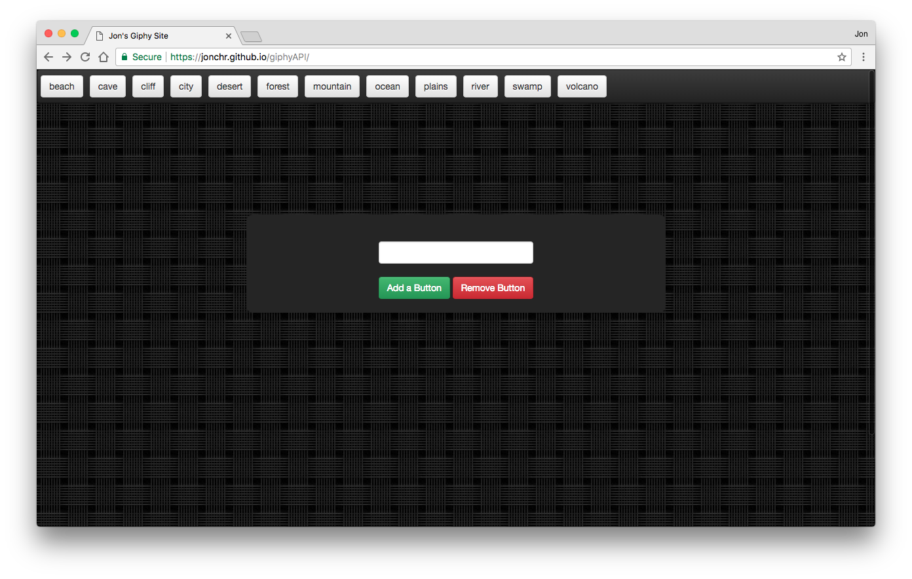
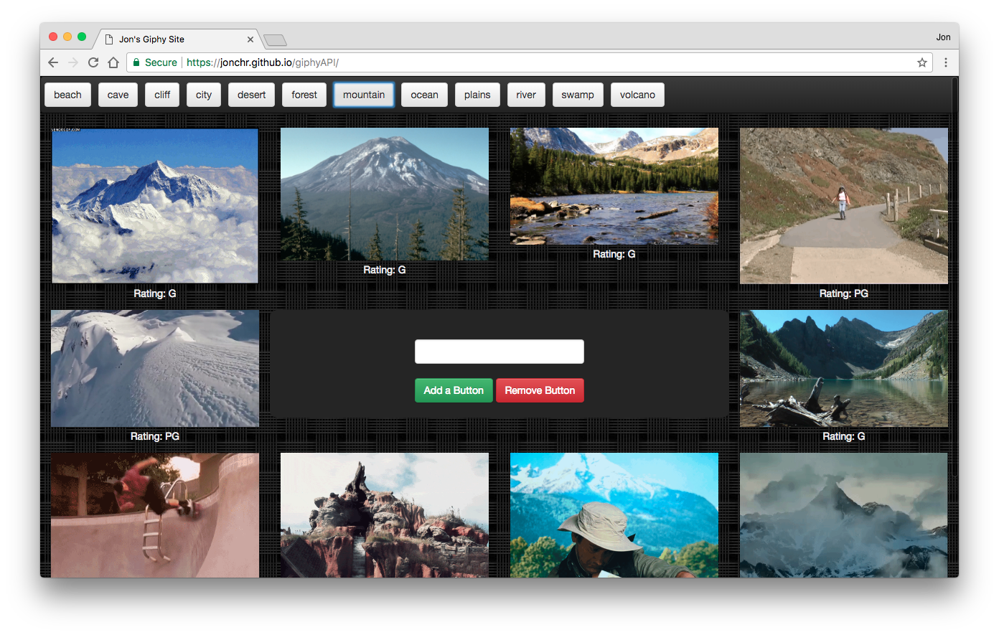

# giphyAPI
This website loads GIFs using AJAX calls to the Giphy API. A live version can be viewed at https://jonchr.github.io/giphyAPI

## Description

This app has two functions: adding buttons to the header, and loading GIFs when one of said buttons is pressed.

The page comes with several buttons already loaded to the header. Buttons can be added or removed via the center form by entering the button name and pressing the add or remove buttons. New buttons will appear to the right of existing buttons and will flow onto a new line.

Upon pressing one of the buttons in the header, the page will make an API call to Giphy and will load the ten GIFs that are returned. The GIFs are loaded as static images, and will animate or pause when clicked on. The associated rating of each GIF is displayed underneath it. Due to the nature of Giphy API calls, the same ten GIFs are loaded every time you press the same button.

### Development

This site was developed as part of the GW Coding Bootcamp and was completed at the end of the third week. It was built using HTML5, CSS3 with Bootstrap v3.3.7, Javascript, and jQuery. It also uses the Giphy API to load a variety of GIFs using an AJAX Get request. For more information, see https://developers.giphy.com/

The vision for this page when created was to have ten GIFs with a set aspect-ratio such that they would fill the page in a Brady Bunch-esque manner with minimal background space. However, aspect ratio was not a request parameter at the time of development, and thus the layout is at the mercy of whichever GIFs are received in the Get request.

The background image for this page is **Woven** and was used with permission from https://www.toptal.com/designers/subtlepatterns/woven/

### Organization

To run the game locally on your own computer, you can run the following in command line:

		git clone https://github.com/jonchr/giphyAPI.git
		cd giphyAPI
		open index.html

The HTML and CSS code is contained within index.html, while the Javascript and jQuery code is contained within the display.js file.

## Screenshots
### Page without GIFs loaded

### When the Mountain button is clicked and GIFs are loaded

